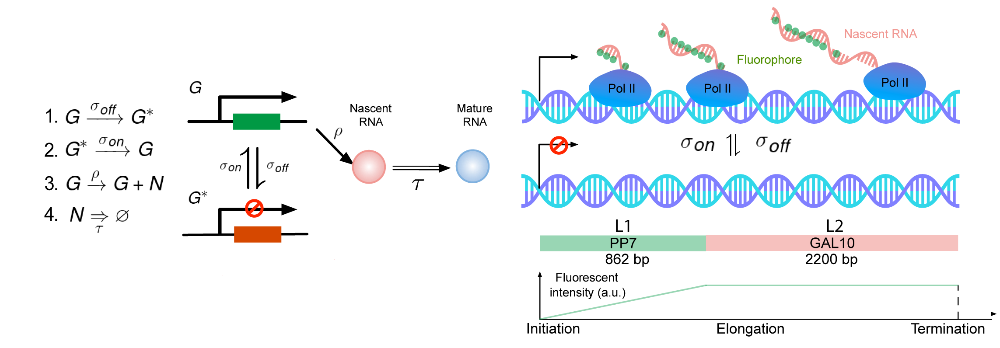
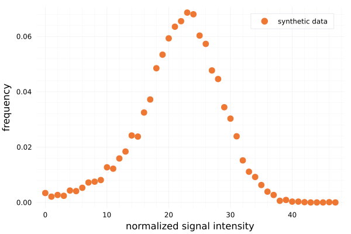

# RNAInferenceTool

<!-- [](https://palmtree2013.github.io/RNAInferenceTool.jl/dev) -->
<!-- [](https://github.com/palmtree2013/RNAInferenceTool.jl/actions/workflows/CI.yml?query=branch%3Amain) -->

This is a Julia package for the paper "Quantifying how post-transcriptional noise and gene copy number variation bias transcriptional parameter inference from mRNA distributions". This package can be installed through the Julia package manager:

```julia
using Pkg
Pkg.add(https://github.com/palmtree2013/RNAInferenceTool.jl)
using RNAInferenceTool
```
Note that the optimization function is a function wrapper of the adaptive differential evolution optimizer from [BlackBoxOptim](https://github.com/robertfeldt/BlackBoxOptim.jl), that package is Copyright (c) 2013-2021: Robert Feldt.

# A quick demo for fitting to the synthetic nascent signal data

## Import data and true parameter set
Suppose we have a set of synthetic nascent RNA data from stochastic simulation algorithm generated from the delay telegraph model (check [this example](https://github.com/palmtree2013/RNAInferenceTool.jl/blob/main/examples/synthetic_data.ipynb) for details on how to generate synthetic data using [DelaySSAToolkit](https://github.com/palmtree2013/DelaySSAToolkit.jl)). The delay telegraph model can be described as 


Here we define the rate of switching from the active (ON) state to inactive (OFF) state as `σ_off`, the rate of switching from the OFF state to the ON state as `σ_on`. `ρ_on` represents the initiation rate when the gene state is ON. `ρ_off` represents the initiation rate when the gene state is OFF (leaky initiation rate), `d` is the detaching rate of polymerase from the gene, `τ` is the required time delay from the initiation to the completion of the transcription. In this case, `ρ_off` and `d` are both set to zero.  Here `L1` and `L2` represent the PP7 862 bp (the linear increasing part of the fluorescence) and the gene of interest (plateau part of the fluorescence) GAL10 2200 bp respectively. The numerical values are set as 
```julia

# True parameters 
# σ_off, σ_on, ρ_on, ρ_off, d, τ
σ_off, σ_on, ρ_on, ρ_off, d, τ =  [1.0526,8.2034,57.989,0,0,0.5] 
# L1 =  signal fluorescence PP7 862 bp; L2 = GAL10 2200 bp 
L1 = 862; L2 = 2200;

# Here we import synthetic signal generated by delay telegraph model directly 
histo_synthetic = readdlm("histo_synthetic.txt")|>vec
```


## Check the distribution
We can visualize the distribution of the synthetic nascent signal 
```julia
scatter(convert_histo(histo_synthetic), labels="synthetic data") # plot distribution
```



# Inference

## Set search range and inference configuration
We set the search range for each transcriptional parameter as follows
```julia
# For delay model the parameter order: σ_off, σ_on, ρ_on, ρ_off, d, τ
SRange = [(0.0,50.0),(0.0,50.0),(0.0,100.0),(0.0,0.0),(0.0,0.0),(τ,τ)]

# For telegraph model the parameter order: σ_off, σ_on, ρ_on, ρ_off, d(= 1/τ) 
SRange_tele = [(0.0,50.0),(0.0,50.0),(0.0,100.0),(0.0,0.0),(1/τ,1/τ)]
```

Next, we set the data structure for inference `OptimStruct`, which consists of the following elements:

1. data: default type is histogram data (in this work and the following demo, we used this type of data); the other additional supported type is to use probability distribution.
2. stage: `G1()` or `G2()`; where `G2()` type data is inferred by convolution of two G1 stage distribution.
3. dist: the distance function: `Likelihood()`, `Likelihood_fusion()`, `Likelihood_rejection()` and other distance functions in Distances.jl package are supported.
4. model: telegraph model `Telegraph()`, delay telegraph model `Delay()`, and Poisson model `Poisson()` are supported.
   
Keywords arguments:
1. infer_counts: Bool type, `true` if the inferred histogram data is the product count (e.g. the number of Pol II attached to the gene), `false` if the histogram data is the normalized signal intensity (e.g. signal affected by the PP7 Loop).
2. L1 and L2: if `infer_counts` is set to `false` then L1 and L2 must be provided which represents the respective length of the linear part and plateau part of the trapezoid signal function respectively.

```julia
infer_struct = OptimStruct(histo_synthetic, G1(), Likelihood(), Delay(); infer_counts = false, L1 = 862, L2 =2200)
infer_struct_tele = OptimStruct(histo_synthetic, G1(), Likelihood(), Telegraph(); infer_counts = false, L1 = 862, L2 =2200)
```

```julia
estimated_params, distributions = optim_function(SRange, infer_struct, MaxFuncEvals = 10000)
estimated_params_tele, distributions_tele = optim_function(SRange_tele, infer_struct_tele, MaxFuncEvals = 10000)
```

```julia
scatter(distributions[:,2],labels="synthetic data")
plot!([distributions[:,1] distributions_tele[:,1]],lines=(2, :dash),labels=["Delay Telegraph" "Telegraph"])
```


## Compare the parameters
```julia
DataFrame(True = params[1:3],Delay=estimated_params[1:3],Telegraph= estimated_params_tele[1:3])
```
|       |  True  |  Delay   | Telegraph |
| :---: | :----: | :------: | :-------: |
| σ_off | 1.0526 | 0.969954 | 0.433565  |
| σ_on  | 8.2034 | 7.78479  |  3.37541  |
| ρ_on  | 57.989 | 57.6266  |  57.7762  |

## Further use cases
Check the subfolders "mature" and "nascent" under ["examples" folder](https://github.com/palmtree2013/RNAInferenceTool.jl/tree/main/examples) for the numerical experiments described in the paper from mature and nascent mRNA data. 