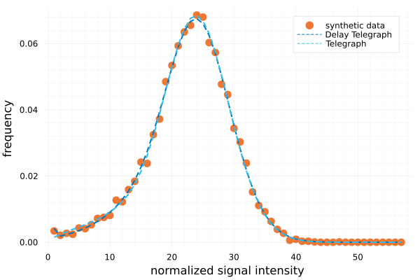

# RNAInferenceTool

<!-- [](https://palmtree2013.github.io/RNAInferenceTool.jl/dev) -->

<!-- [](https://github.com/palmtree2013/RNAInferenceTool.jl/actions/workflows/CI.yml?query=branch%3Amain) -->

This is an auxiliary package for RNA inference paper. This package can be install through the Julia package manager:

```julia
] add https://github.com/palmtree2013/RNAInferenceTool.jl
using RNAInferenceTool
```
Note that the optimization function is a wrapper of adaptive differential evolution optimizier from [BlackBoxOptim](https://github.com/robertfeldt/BlackBoxOptim.jl).

# An quick example of fitting the synthetic nascent signal data

## Import data and true parameter set
Suppose we have a set of synthetic nascent RNA data from stochastic simulation algorithm using delay telegraph model. Please check [this example](https://github.com/palmtree2013/RNAInferenceTool.jl/blob/main/examples/synthetic_data.ipynb) for details on how to generate synthetic data using [DelaySSAToolkit](https://github.com/palmtree2013/DelaySSAToolkit.jl). The delay telegraph model can be described as 

where the parameters are 
```julia
# True parameters 
# σ_off, σ_on, ρ_on, ρ_off, d, τ, SSA final time
σ_off, σ_on, ρ_on, ρ_off, d, τ, tf =  [1.0526,8.2034,57.989,0,0,0.5, 20.] 
# L1 =  signal fluorescence PP7 862 bp; L2 = GAL10 2200 bp 
L1 = 862; L2 = 2200; 
```
Here `ρ_off` represents the initiation rate when the gene state is inactive (leaky telegraph model), `d` is the possible detaching rate of polymerase from the gene. In this case, they are both set to zero.  Here `L1` and `L2` represents the PP7 862 bp (the linear increasing part of the fluorescence) and gene of interest (plateu part of the fluorescence) GAL10 2200 bp respectively.

## Check the distribution

```julia
scatter(convert_histo(histo_synthetic), labels="synthetic data") # plot distribution
```


# Inference

## Set search range and inference configuration

```julia
#For delay model the parameter order: σ_off, σ_on, ρ_on, ρ_off, d, τ
SRange = [(0.0,50.0),(0.0,50.0),(0.0,100.0),(0.0,0.0),(0.0,0.0),(τ,τ)]

#For telegraph model the parameter order: σ_off, σ_on, ρ_on, ρ_off, d = 1/τ 
SRange_tele = [(0.0,50.0),(0.0,50.0),(0.0,100.0),(0.0,0.0),(1/τ,1/τ)]
```

The `OptimStruct` consists of four elements:

1. data: default type is histogram data; the other supported type is to use distribution directly.
2. stage: `G1` or `G2`; where `G2` type data is inferred by setting G2 = G1*G1 (convolution).
3. dist: the distance function: Likelihood, Likelihood_fusion, Likelihood_rejection and other distance functions in Distances.jl are supported.
4. model: telegraph model, delay telegraph model, and Poisson model are supported.
5. infer_counts: `true` if the inferred histogram data represents the number of count of the product (mature or bound Pol II), `false` if the histogram data represents the normalised signal insensity.
6. L1, L2: if infer_counts is set `false` then L1 and L2 must be provided which represents the indices of the trapezoid signal function.

```julia
infer_struct = OptimStruct(histo_synthetic, G1(), Likelihood(), Delay(); infer_counts = false, L1 = 862, L2 =2200)
infer_struct_tele = OptimStruct(histo_synthetic, G1(), Likelihood(), Telegraph(); infer_counts = false, L1 = 862, L2 =2200)
```

```julia
estimated_params, distributions = optim_function(SRange, infer_struct, MaxFuncEvals = 10000)
estimated_params_tele, distributions_tele = optim_function(SRange_tele, infer_struct_tele, MaxFuncEvals = 10000)
```

```julia
scatter(distributions[:,2],labels="synthetic data")
plot!([distributions[:,1] distributions_tele[:,1]],lines=(2, :dash),labels=["Delay Telegraph" "Telegraph"])
```



## Compare the paramters
```julia
DataFrame(True = params[1:3],Delay=estimated_params[1:3],Telegraph= estimated_params_tele[1:3])
```
|       |  True  |  Delay   | Telegraph |
| :---: | :----: | :------: | :-------: |
| σ_off | 1.0526 | 0.969954 | 0.433565  |
| σ_on  | 8.2034 | 7.78479  |  3.37541  |
| ρ_on  | 57.989 | 57.6266  |  57.7762  |
